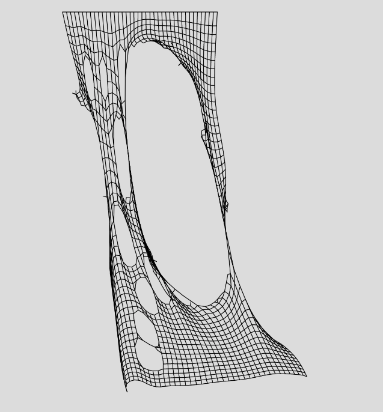

# Verlet integration to simulate motion

This javascript snippet simulates a net of sticks based on the **Verlet integration**.

It uses the p5.js library for drawing and input.

## Use

Simply open the *.html* file. By pressing and dragging the mouse over the net it removes the sticks near the mouse position and thus simulates a cute along the mouse path. By clicking on the canvas a force in the direction opposite to the point is applied.

